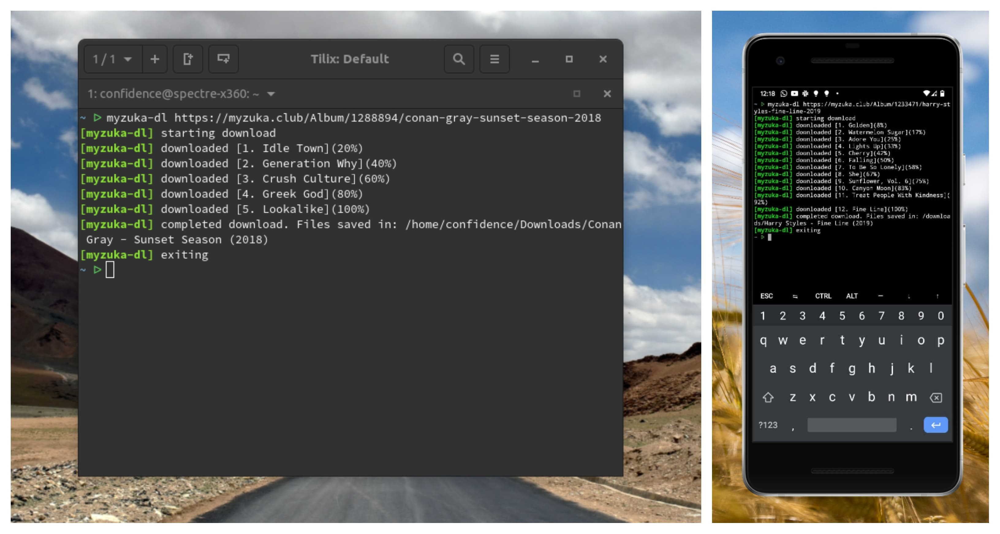

# myzuka-dl [](https://travis-ci.org/Confidence-Okoghenun/myzuka-dl)

A **_music album_** downloading tool. `myzuka-dl` lets you download entire music albums with urls from sites not supported by `youtube-dl`

## Install

```
$ yarn global add myzuka-dl
//or
$ npm install -g myzuka-dl
```

## Usage



Use like so `myzuka-dl <album-url>` ie:

```
$ myzuka-dl https://myzuka.club/Album/879283/Dan-Croll-Compliment-Your-Soul-2013
```

> Note: Downloaded albums are saved in your `downloads` folder.

## Supported sites

- [myzuka.club](https://myzuka.club) (Russian site, use Google Translate)

More coming soon.

## Suggestions and Request
Send your suggestions, requests and feedback to my personal mail [confidenceboi@gamil.com](mailto:confidenceboi@gmail.com). I'll reply as soon as I can, promise :stuck_out_tongue_winking_eye: